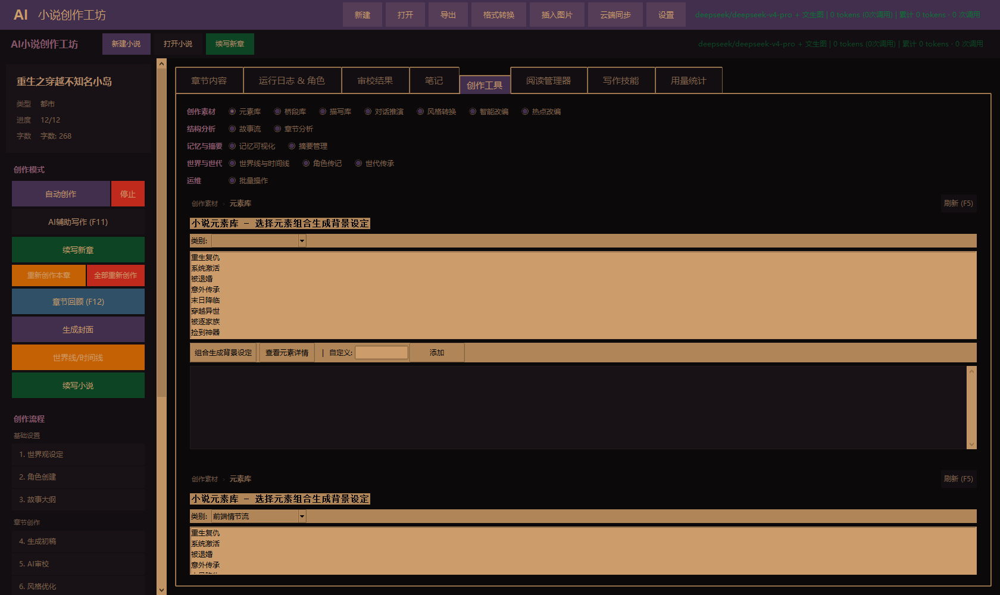
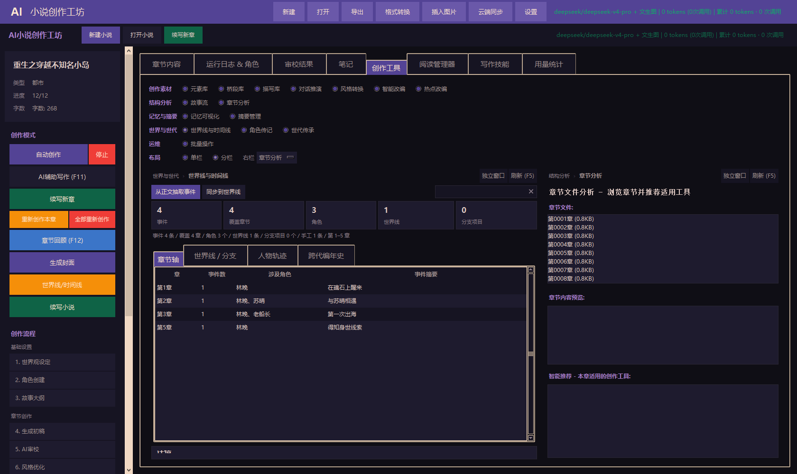
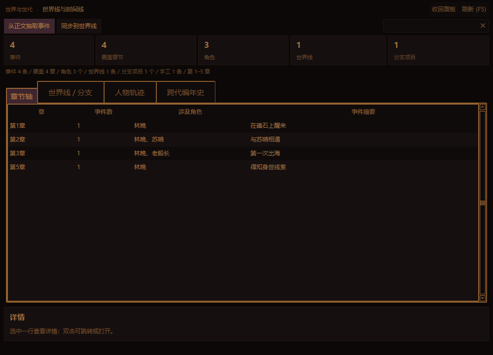
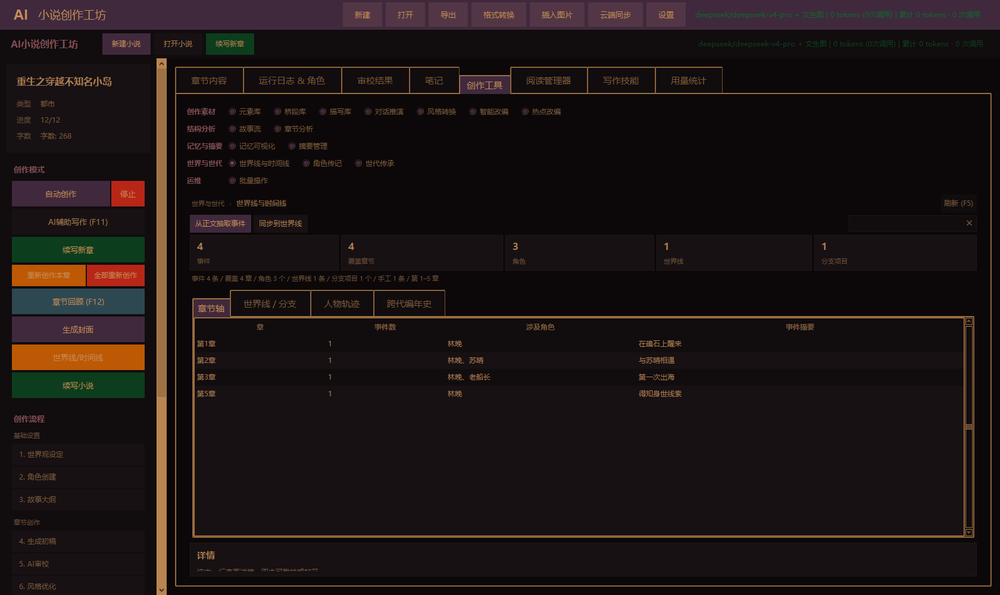

# AI小说创作工坊 v3.1.0

[](https://github.com/ATboy-web/AI_NovelWriter/actions/workflows/ci.yml)
[](https://github.com/ATboy-web/AI_NovelWriter/releases/latest)
[](https://www.python.org/downloads/)
[](LICENSE)
[](#开发)

基于 AI 的长篇小说创作工坊 —— **15 种题材**、**5 Agent 协作**、**面板化工作台**、
**世界线分支与世代传承**、**多 AI 服务适配与用量成本统计**。

桌面端为 Windows 单文件 EXE；另有 Android 应用、FastAPI 后端集群与 React Web 前端。



## 下载

| 平台 | 版本 | 大小 | 链接 |
|------|------|------|------|
| **Windows** | **v3.1.0** | ~25 MB | [AI_NovelWriter.exe](https://github.com/ATboy-web/AI_NovelWriter/releases/latest) |
| Android | v4.0.1（沿用上一次构建） | ~10.9 MB | [AI_NovelWriter_v4.0.1.apk](https://github.com/ATboy-web/AI_NovelWriter/releases/tag/v2.16.0) |

> 单文件免安装：下载后直接双击运行。首次启动需在 **设置** 里配置 AI 服务。

## 快速开始

1. 下载并运行 `AI_NovelWriter.exe`
2. 打开 **设置 → AI 服务**，选择服务商并填入 API Key（或使用本地 Ollama，无需密钥）
3. 点击 **新建小说**，输入标题、题材、核心概念
4. 点击 **自动创作**：大纲 → 角色 → 章节全自动生成
5. 在 **创作工具** 页用 15 个面板精修设定、时间线、角色传记与世代传承

## 功能特性

### 创作引擎
- **一键自动生成**：大纲 → 角色 → 章节全流程自动化
- **5 Agent 协作**：PlotDesigner → WorldBuilder → Writer → Reviewer → Editor
- **多轮迭代修订**：AI 审校反馈自动回流修订，质量阈值判定
- **15 种题材**：科幻 / 悬疑 / 言情 / 奇幻 / 都市 / 历史 / 武侠 / 仙侠 / 恐怖 / 军事 / 游戏 /
  体育 / 穿越 / 系统流 / 末日
- **续写**：已完成的作品可续写新章，上下文无缝衔接

### 面板化工作台（15 个面板 / 5 个分组）

| 分组 | 面板 |
|------|------|
| 创作素材（7） | 元素库 · 事物描写 · 情景对话 · 故事流推演 · 风格转换 · 桥段库 · 联网检索 |
| 结构分析（2） | 章节分析 · 批量操作 |
| 记忆与摘要（2） | 记忆可视化 · 摘要管理 |
| **世界与世代（3）** | **世界线与时间线 · 角色传记 · 世代传承** |
| 运维（1） | 用量与成本 |

- 面板框架统一提供**面包屑 + 刷新按钮 + 状态栏 + F5 / Ctrl+F / Esc**，
  新增面板只需在注册表加一行。
- **分栏与停靠记忆**：选择器末行可切「单栏 / 分栏」并指定右栏面板，
  两个面板并排工作；布局（含分隔条比例、已脱出的面板）**下次启动自动恢复**。
- 任何面板都能**脱离为独立窗口**（面包屑右上角「独立窗口」），可与主窗口并排摆放；
  关掉窗口即自动收回，换书时窗口里的内容同步重建。
- 基于线程感知事件总线联动：某处写入成功后，相关面板自动刷新。





### 世界线 · 分支 · 世代
- 每章自动检测决策点；主线完结后可生成**分支世界线**
- 分支子项目是**可打开的作品**：进代际树、双击即可切换创作
- 分支与父代**属同一代**（另一条世界线），但**只读父代**：
  写入分支内部允许，**逃逸到父代被拒**（路径护栏 + 测试断言）
- 世代传承：代际树、继承计划（年龄推进 / 死亡状态 / 未解伏笔继承报告）



### 角色系统
- 角色五维档案（属性 / 武器 / 技能 / 性格 / 背景）
- **结构化传记**：分段、故事线、来源与 token 归因，可导出
- 桥段库（10 种类别、6 种基调）、角色活动轨迹与重要性追踪
- 角色成长自动追踪；**传记面板无删除角色入口**，数据保护有三道防线

### 多 AI 服务与成本
- **Provider 注册表 + 适配器**：Ollama（本地）/ OpenAI 兼容接口 / Anthropic / DeepSeek /
  智谱 GLM / Qwen / Kimi 等
- **多套 API Profile**：按服务商独立保存地址与密钥，随时切换
- **用量与成本**：token 归因与持久化、分档价目表（含缓存价与币种差异）、成本估算
- **余额查询**：DeepSeek 支持官方余额接口；无公开余额 API 的服务商如实标注

### 创作工具
- 元素库（10 类别）、情景对话推演、故事流推演（正向 / 反向 / 插值 / 分支）
- 风格转换（7 种模板）、AI 封面生成器、文生图提示词（电影级镜头语言）

### 导出与阅读
- 多格式导出：TXT / EPUB / PDF / DOCX / Markdown
- 阅读管理器支持多种电子书格式

## 系统要求

- Windows 10/11（64 位）
- 至少 4 GB 内存
- AI 服务二选一：本地 **Ollama**（推荐 14B+ 模型）或云端 API Key

## 项目结构

```
ai-novel-writer/
├── novel_app.py              # 桌面端薄编排层
├── app/                      # 桌面端应用包（唯一需要安装的发行包）
│   ├── panels/               #   ├─ 面板框架：registry / host / base / legacy / ui_kit + 15 个面板
│   ├── providers/            #   ├─ 多 AI 服务：注册表 / 适配器 / 价目表 / 余额 / 推理模型
│   ├── events/               #   ├─ 线程感知事件总线
│   ├── ai_client.py          #   ├─ 统一 AI 客户端与路由
│   ├── novel_agent.py        #   ├─ 5 Agent 协作引擎
│   ├── agent_orchestrator.py #   ├─ 智能体编排
│   ├── memory_manager.py     #   ├─ 分层记忆（全局/卷/弧线/章节）+ 角色数据护栏
│   ├── timeline_store.py     #   ├─ 时间线统一存储（指纹缓存 / 一次取数）
│   ├── lineage.py            #   ├─ 世代传承与"只读父代"护栏
│   ├── biography.py          #   ├─ 结构化传记
│   ├── usage_tracker.py      #   ├─ 用量与成本统计
│   ├── *_ui.py               #   └─ 12 个功能域界面 Mixin
│   └── ...
├── backend/                  # FastAPI 后端集群
│   ├── ai-service/           #   AI 模型服务（:8001）
│   ├── novel-service/        #   小说生成服务（:8002）
│   └── shared/               #   共享中间件
├── frontend-react/           # React Web 前端
├── mobile-app/novel-app/     # Android 应用（Kotlin + Compose）
├── installer/                # PyInstaller 打包配置（novel_app.spec 等）
├── tests/                    # 测试（71 个文件，含界面质量度量与门禁）
├── docs/                     # 项目文档（索引见 docs/README.md）
├── monitoring/               # Prometheus / Grafana / Alertmanager / Loki
├── nginx/ · scripts/         # 反向代理配置 · 运维与备份脚本
├── docker-compose.yml        # 本地编排（生产用 docker-compose.prod.yml）
├── CHANGELOG.md              # 更新日志
└── CONTRIBUTING.md           # 贡献指南
```

## 开发

```bash
# 安装（含开发依赖）
pip install -e ".[dev]"

# 运行桌面端
python novel_app.py

# 运行测试（testpaths 覆盖 tests 与 backend/tests）
python -m pytest -v

# 代码质量
ruff check app/ tests/
ruff format --check app/ tests/
```

> ⚠️ 全量测试请**按文件分块执行**：约 2250 个用例，单次全量运行在受限环境中可能被
> 临时文件清理策略打断。

### 构建 Windows EXE

```bash
cd installer
python -m PyInstaller novel_app.spec --noconfirm
# 产物：installer/dist/AI_NovelWriter.exe
```

或直接运行仓库根的 `build.bat`（自动探测可用的 Python 解释器）。

## Docker 部署

```bash
cp .env.example .env         # 配置数据库密码等
docker-compose up -d
docker-compose ps            # 查看状态
```

| 服务 | 地址 |
|------|------|
| Web 前端 | http://localhost:3000 |
| AI 服务 | http://localhost:8001 |
| 小说服务 | http://localhost:8002 |
| Prometheus / Grafana | http://localhost:9090 / http://localhost:3001 |

## 版本与发布

- **版本号单一权威源**：`pyproject.toml` 的 `version`（`app.__version__` 与 README 均与之一致，
  由 `tests/test_version_consistency.py` 守护）
- **更新日志**：[CHANGELOG.md](CHANGELOG.md)
- **发布规范**：[docs/VERSION_RELEASE_SPEC.md](docs/VERSION_RELEASE_SPEC.md)
- **发布产物**：二进制不入库（见 `.gitignore`），统一通过
  [GitHub Releases](https://github.com/ATboy-web/AI_NovelWriter/releases) 分发

## 文档

完整文档索引见 **[docs/README.md](docs/README.md)**，常用入口：

| 文档 | 说明 |
|------|------|
| [QUICKSTART.md](QUICKSTART.md) | 快速上手 |
| [USAGE.md](USAGE.md) | 使用说明 |
| [docs/ROADMAP_V3_PANELS_AND_PROVIDERS.md](docs/ROADMAP_V3_PANELS_AND_PROVIDERS.md) | v3 改造方案与实施进度 |
| [docs/NEXT_STEPS.md](docs/NEXT_STEPS.md) | 下一步行动计划 |
| [docs/API.md](docs/API.md) | 后端 API |
| [docs/ui_review/](docs/ui_review/) | 界面改造前后对照截图 |

## 贡献

欢迎提交 Issue 与 PR！请先阅读 [CONTRIBUTING.md](CONTRIBUTING.md)。

## 许可证

[MIT Modified License](LICENSE) —— 可自由使用与修改，**商用需注明来源**
（项目名称 + GitHub 链接）。
